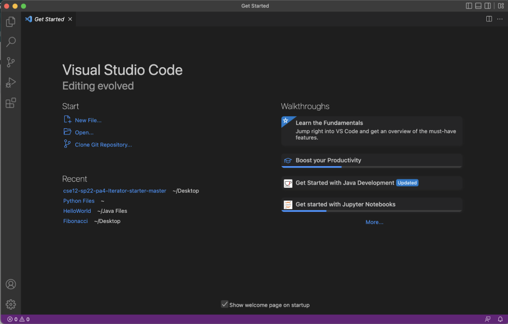
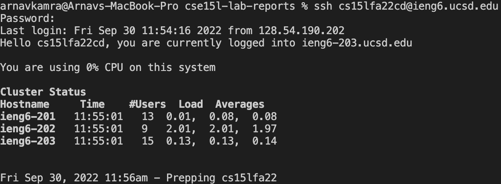
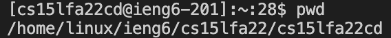
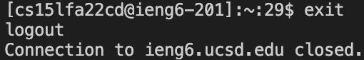
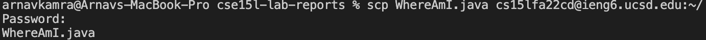
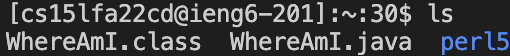
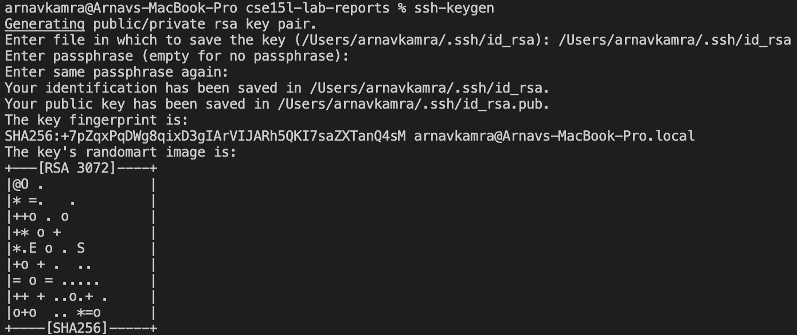
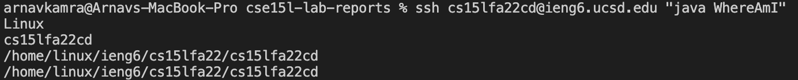
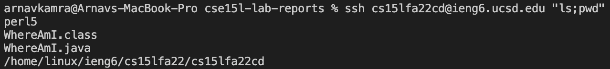

# Week 1 Lab Report
## **Step 1: Installing Visual Studio Code**
1. Visit the [Virtual Studio Code](https://code.visualstudio.com/) website
2. Follow the steps for installation of the latest version of VS Code 

    **Note: Make sure to take into account your operating system when installing the software (OSX, Windows, Linux, etc.)**

3. When installed you should have a welcome screen similar to the following:

___
## **Step 2.1: CSE 15L Account**
1. Look up your [CSE 15L course-specific username](https://sdacs.ucsd.edu/~icc/index.php) (this will be the email for the ssh remote connection)
2. After logging in with your UCSD username and PID, you will be able to reset your password for the 15L course specific account
    * Your username should begin with cs15lfa22 followed by two random characters
    * Resetting your password is needed for accessing the remote connection
        * It may require multiple attempts/delays before it successfully resets
## **Step 2.2: Remotely Connecting**
1. To remotely connect using ssh, open a new terminal in VS Code and type the following command:
    ```
    ssh cs15lfa22xx@ieng6.ucsd.edu
     ```
    **Note: Make sure to replace 'xx' with your course specific username's characters found in Step 2.1**
2. Make sure to accept any authentication requests by typing *yes* followed *enter*
3. You will then be prompted to enter the newly reset password 
    
    **Note: Make sure to enter your password correctly and press enter. The screen will not show any characters on the screen, and will automatically end the command after three failed attempts.**
4. If successfully logged in, the terminal will greet you with the following prompt:

___
## **Step 3: Trying Some Commands**
1. While logged in, try some of the following commands:
    
    `cd ~` : Jumps to the home directory
    
    `cd` : Used for searching through directories 

    `ls` : Used to obtain a listing of the current directory
    
    `pwd` : Prints the currenting working directory path, starting from the root
    
    * **Example:**
 
    
    `exit` : For logging out of the remote server in terminal

    * **Example:**


    **Note: There are countless more commands with many useful applications (research Linux/terminal commands)**
___
## **Step 4: Moving Files with `scp`**
1. `scp` is used to copy a file/folder (or many files/folders) from your computer directly to the remote computer
2. Make sure to run this command directly on your device's terminal, not when logged in to the remote computer
3. Example of copying a sample Java file to the remote computer:

    
    **Note: Make sure to use your login address followed by `:~/`. You will also have to enter your password again.**
4. Checking the remote computer using `ls` to verify that the file has been copied: 

    

___
## **Step 5: Setting an SSH Key**
1. `ssh` keys are a way to bypass having to enter your password everytime `ssh` and `scp` are run
2. For this to be done, a file containing a public and private key are created by a program called `ssh-keygen`
3. The public key is copied to the server and the private key to the client (your device), acting in place of your password

4. Setting up the `ssh` key:

    

    * **Note 1: Make sure to run the `ssh-keygen` command on your device terminal (not the remote connection)**
    
    * **Note 2: Press *enter* when prompted for the file to save the key (sets to default path)**

5. Copy the public key to the `.ssh` directory on the remote account with the following command:
    
        scp [DEFAULT PATH] cs15lfa22[xx]@ieng6.ucsd.edu:~/.ssh/authorized_keys

    **Note: Make sure to use the default path set in the previous step, as well as your personal acccount login** 
___
## **Step 6: Optimize Remote Running**
___
1. Setting up the `ssh` key allows chaining of commands for the remote connection
2. Hence, the commands from Step 3 can be used in the same line as the `ssh` login, and commands can be chained using `;`

**Some Examples:**
    
* Running the sample Java program directly:

* Running `pwd` and `ls` concurrently on the remote computer:

___


