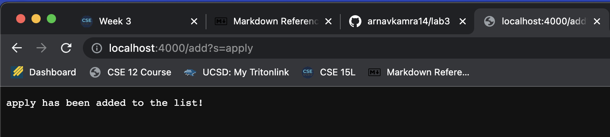
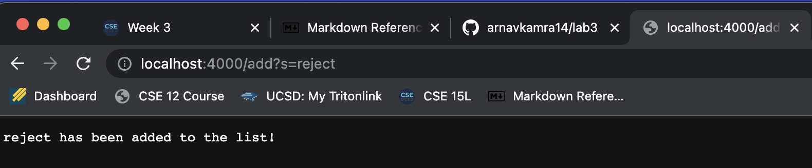
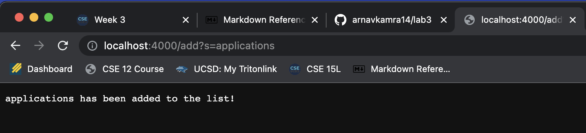
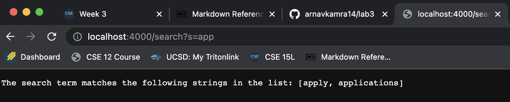

# Week 3 Lab Report
## **Part 1: Simplest Search Engine**

**SearchEngine.java Code:**

```
import java.io.IOException;
import java.net.URI;
import java.util.ArrayList;
import java.lang.*;

class Handler implements URLHandler {
    // The one bit of state on the server: a number that will be manipulated by
    // various requests.
    ArrayList<String> wordList = new ArrayList<String>();
    String matches = "";

    public String handleRequest(URI url) {
        if (url.getPath().equals("/")) {
            return String.format(
                    "Welcome to the Search Engine!\nUse the 'add' path to add an string to the list and 'search' to query the list of strings");
        } else {
            if (url.getPath().contains("/add")) {

                String[] parameters = url.getQuery().split("=");

                if (parameters[0].equals("s")) {
                    wordList.add(parameters[1]);
                    return String.format("%s has been added to the list!", parameters[1]);
                }
            }
            if (url.getPath().contains("/search")) {
                System.out.println(wordList);
                String[] parameters = url.getQuery().split("=");
                ArrayList<String> matchStor = new ArrayList<String>();

                if (parameters[0].equals("s")) {
                    for (int i = 0; i < wordList.size(); i++) {
                        if (wordList.get(i).contains(parameters[1])) {
                            matchStor.add(wordList.get(i));
                        }
                    }
                }

                if (matchStor.size() > 0) {
                    return String.format("The search term matches the following strings in the list: %s",
                            matchStor.toString());
                } else {
                    return String.format("No strings matched '%s'", parameters[1]);
                }

            } else {
                return "404 Not Found!";
            }
        }

    }
}

class SearchEngine {
    public static void main(String[] args) throws IOException {
        if (args.length == 0) {
            System.out.println("Missing port number! Try any number between 1024 to 49151");
            return;
        }

        int port = Integer.parseInt(args[0]);

        Server.start(port, new Handler());
    }
}
```
**Adding using SearchEngine.java (1):**

**Adding using SearchEngine.java (2):**

**Adding using SearchEngine.java (3):**

* Whenever values are added, the URL of the server is updated, and therefore the Handler class containing the handleRequest function is run
* Based on the URL path (which contains add in this case), the URL's contents are divided to isolate the word to be added
* The word is then added to an ArrayList (to be stored for the query feature), and a success message is returned to the server
* This same process is repeated for each of the add URLs above, as shown by the message returned to the server

**Query using SearchEngine.java:**

* The query feature relies on 'search' appearing in the server URL, similar to 'add' when adding
* When a string is queried for, a for loop is run through the list of added words
* Any matches containing the requested string will be added to a new ArrayList
* If the size of the new List is greater than 0, the queried list is displayed. If not, a message indicating no matches found will be returned to the server

---

## **Part 2.1: Testing ArrayExamples.java**
**Failure-inducing Input:** 
```
@Test
public void testReverseInPlaceValues() {
    int[] input1 = { 1, 3, 5, 7 };
    ArrayExamples.reverseInPlace(input1);
    int[] expected = { 7, 5, 3, 1 };
    assertArrayEquals(expected, input1);
}
```
**Symptom:**
```
2) testReverseInPlaceValues(ArrayTests)
arrays first differed at element [2]; expected:<3> but was:<5>
        at org.junit.internal.ComparisonCriteria.arrayEquals(ComparisonCriteria.java:78)
        at org.junit.internal.ComparisonCriteria.arrayEquals(ComparisonCriteria.java:28)
        at org.junit.Assert.internalArrayEquals(Assert.java:534)
        at org.junit.Assert.assertArrayEquals(Assert.java:418)
        at org.junit.Assert.assertArrayEquals(Assert.java:429)
        at ArrayTests.testReverseInPlaceValues(ArrayTests.java:23)
        ... 30 trimmed
Caused by: java.lang.AssertionError: expected:<3> but was:<5>
        at org.junit.Assert.fail(Assert.java:89)
        at org.junit.Assert.failNotEquals(Assert.java:835)
        at org.junit.Assert.assertEquals(Assert.java:120)
        at org.junit.Assert.assertEquals(Assert.java:146)
        at org.junit.internal.ExactComparisonCriteria.assertElementsEqual(ExactComparisonCriteria.java:8)
        at org.junit.internal.ComparisonCriteria.arrayEquals(ComparisonCriteria.java:76)
        ... 36 more
```


**Bug Fix:**
```
for(int i = 0; i < arr.length/2; i += 1) {
      arr[i] = arr[arr.length - i - 1];
}
```
* Change bounds of the for loop from arr.length to arr.length/2

**Connection between Symptom and Bug:**

* After reaching the halfway point of the for loop responsible for reversing the array, the logic of the loop is no longer applicable
* Therefore, only half of the values in the array get accurately switched


---

## **Part 2.2: Testing ListExamples.java**
**Failure-inducing Input:**
```
@Test
    public void mergeTest() {

        List<String> input1 = new ArrayList<>();
        input1.add("Apple");
        input1.add("Bat");
        input1.add("California");

        List<String> input2 = new ArrayList<>();
        input2.add("Dog");
        input2.add("Elephant");
        input2.add("Firefighter");

        List<String> expected = new ArrayList<>();
        input1.add("Apple");
        input1.add("Bat");
        input1.add("California");
        input2.add("Dog");
        input2.add("Elephant");
        input2.add("Firefighter");

        assertArrayEquals(expected.toArray(), (ListExamples.merge(input1, input2)).toArray());

}
```

**Symptom:**
* Before Interface Implementation:
```
    1) mergeTest(ListTests)
    arrays first differed at element [3]; expected:<[Dog]> but was:<[Cat]>
        at org.junit.internal.ComparisonCriteria.arrayEquals(ComparisonCriteria.java:78)
        at org.junit.internal.ComparisonCriteria.arrayEquals(ComparisonCriteria.java:28)
        at org.junit.Assert.internalArrayEquals(Assert.java:534)
        at org.junit.Assert.assertArrayEquals(Assert.java:285)
        at org.junit.Assert.assertArrayEquals(Assert.java:300)
        at ListTests.mergeTest(ListTests.java:28)
        ... 30 trimmed
    Caused by: org.junit.ComparisonFailure: expected:<[Dog]> but was:<[Cat]>
        at org.junit.Assert.assertEquals(Assert.java:117)
        at org.junit.Assert.assertEquals(Assert.java:146)
        at org.junit.internal.ExactComparisonCriteria.assertElementsEqual(ExactComparisonCriteria.java:8)
        at org.junit.internal.ComparisonCriteria.arrayEquals(ComparisonCriteria.java:76)
        ... 36 more
```

**Bug Fix:**
```
if (list1.get(index1).compareTo(list2.get(index2)) < 0) {
        result.add(list1.get(index1));
        index1 += 1;
} else {
        result.add(list2.get(index2));
        index2 += 1;
}
```
* In the if-else statement of the while loop in the merge function, the else statement incremented index2 instead of index1.

**Connection between Symptom and Bug:**
* The mechanism in the function that compared the two values in the sorted lists was buggy. Hence two lists were not properly being compared to one another.
* If the two lists were indepedently sorted and the merge function just needed to append one list to the other (ex. List 1: A, B, C and List 2: D, E, F), the function would work fine, the bug only occured when trying to compare each element in the list to the elements in the other list
* Correctly incrementing the index2 allows the while loop to work as expected, correctly sorting the two lists into one another.


