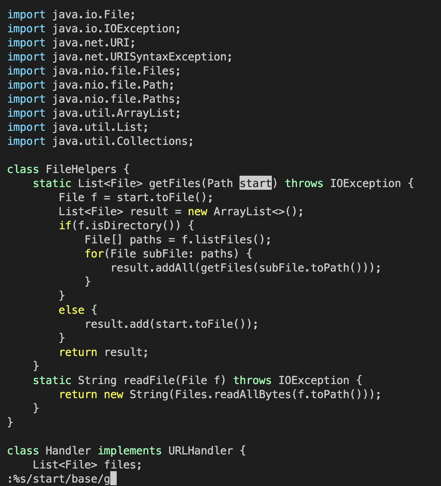
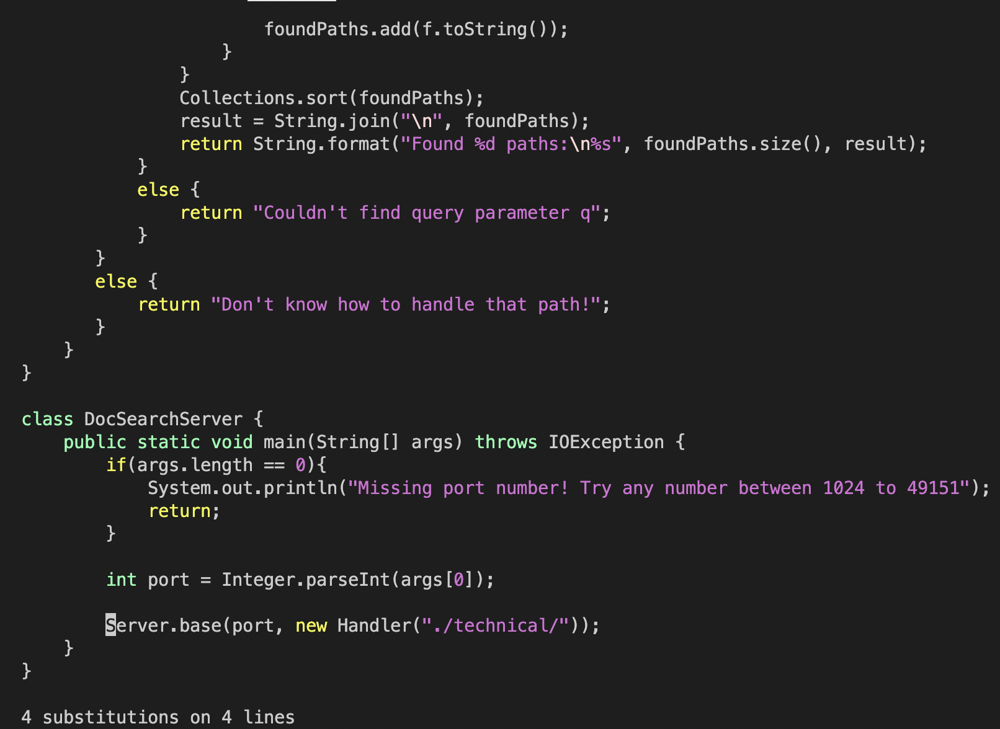

# Week 7 Lab Report

## **Part 1**

**Task 1 - In DocSearchServer.java, change the name of the start parameter of getFiles, and all of its uses, to instead be called base:**

**Vim Command:** 

`:s%/start/base/g` followed by  `<enter>`

**Explanation:** 
- The basic substitute command according to the Vim manual is as follows:

        :s/<searchTerm>/<termToReplace>/options

- The `/g` option replaces every instance on the line

- However, in order to replace the entire file, we must use the `%` shorthand, which is used at the beginning of a command to reference the whole file

- Therefore, to replace all occurrences of start to base in the file, the command becomes the following (assuming the file is open in Vim): 
        
        :s%/start/base/g
        
**Vim window of DocSearchServer.java before command executes:**

* Once the command is typed in, the cursor selects the first instance of `start` to be replaced

**Vim window of DocSearchServer.java after command executes:**

* Once the command executes, the Vim command line shows the number of substitutions made
* The cursor is set to the beginning of the line that had the last replace of `start` to `base`

## **Part 2**
**Time took using VS Code**: 58 seconds

**Time took using Vim**: 41 seconds

**1. Which of these two styles would you prefer using if you had to work on a program that you were running remotely, and why?**

I would use Vim, since I can directly edit the file from the remote server. If using VSCode, I would have to copy the file to the remote directory every time I need to publish/test any changes. Especially if working with a group, where everyone is editing the remote server, it may be better to make changes remotely directly.

**2. What about the project or task might factor into your decision one way or another? (If nothing would affect your decision, say so and why!)**

Vim has many shorthands/commands that can be used to make mass edits to a file quickly and efficiently. However, for modifying things like Java projects, I would prefer to use VSCode, since it has a bigger and easier UI. Parsing and editing through a file is generally easier with VSCode, but if the file is hard to access or requires many steps before being able to modify it through VSCode, Vim may be the preferred editor.
