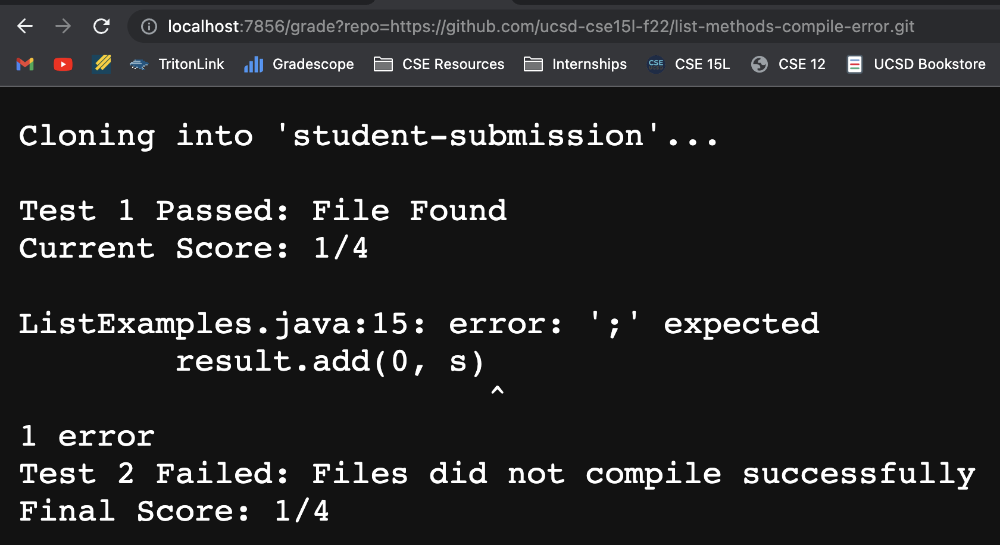
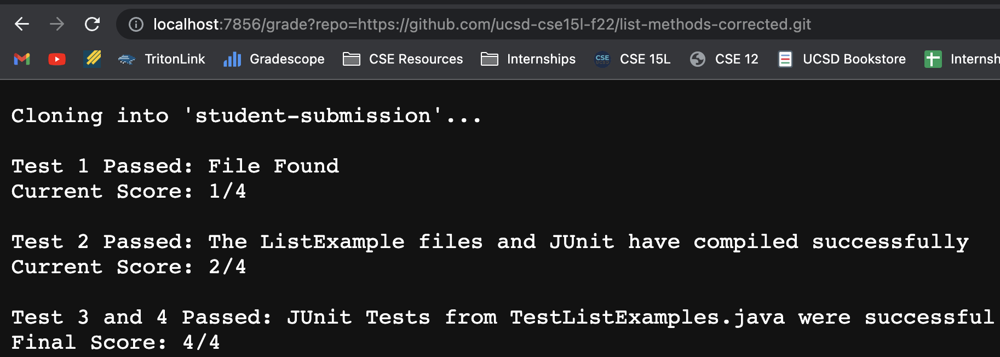

# **Week 9 - Lab Report 5**
## **grade.sh script code**
```
set -e

rm -rf student-submission
git clone $1 student-submission

cd student-submission

if [ -e "ListExamples.java" ];
then
    cd ..
    cp ./student-submission/ListExamples.java ListExamples.java
    echo ""
    echo "Test 1 Passed: File Found"
    echo "Current Score: 1/4"
    echo ""
else    
    echo ""
    echo "Test 1 Failed: The ListExamples.java file does not exist in the submission"
    echo "Final Score: 0/4"
    echo ""
    exit 1
fi

CPATH=".:lib/hamcrest-core-1.3.jar:lib/junit-4.13.2.jar"

set +e
javac -cp $CPATH *.java

if [[ $? -eq 0 ]]
then
    echo "Test 2 Passed: The ListExample files and JUnit have compiled successfully"
    echo "Current Score: 2/4"
    echo ""
else
    echo "Test 2 Failed: Files did not compile successfully"
    echo "Final Score: 1/4"
    echo ""
    exit 1
fi

java -cp $CPATH org.junit.runner.JUnitCore TestListExamples > output.txt

if [[ $? -eq 0 ]]
then
    echo "Test 3 and 4 Passed: JUnit Tests from TestListExamples.java were successful"
    echo "Final Score: 4/4"
    echo ""
    exit 0
else
    echo "Test 3 or 4 Failed: JUnit Tests from TestListExamples.java were unsuccessful"
    grep "Tests run:" output.txt
    exit 1
fi
```
---

## **Student Submission: list-methods-filename**


## **Student Submission: list-methods-compile-error**


## **Student Submission: list-methods-corrected**


---

## **grade.sh trace for list-methods-corrected**
```
set -e 
```
* standard output: nothing
* standard error: nothing
* return code: 0 

```
rm -rf student-submission
``` 
* standard output: nothing
* standard error: nothing
* return code: 0 

```
git clone $1 student-submission
```
* standard output: Cloning into 'student-submission'...
* standard error: nothing
* return code: 0

```
cd student-submission
```
* standard output: nothing
* standard error: nothing
* return code: 0 

```
if [ -e "ListExamples.java" ];     
then
    cd ..
    cp ./student-submission/ListExamples.java ListExamples.java
    echo ""
    echo "Test 1 Passed: File Found"
    echo "Current Score: 1/4"
    echo ""
```
* The file is found
* The then block of the if statement is run 
* Condition is true
```
else    
    echo ""
    echo "Test 1 Failed: The ListExamples.java file does not exist in the submission"
    echo "Final Score: 0/4"
    echo ""
    exit 1
fi
```
* This block is not run

```
CPATH=".:lib/hamcrest-core-1.3.jar:lib/junit-4.13.2.jar"
```
```
set +e
```
* standard output: nothing
* standard error: nothing
* return code: 0 

```
javac -cp $CPATH *.java
```
* standard output: nothing
* standard error: compile error
* return code: 0 

```
if [[ $? -eq 0 ]]
then
    echo "Test 2 Passed: The ListExample files and JUnit have compiled successfully"
    echo "Current Score: 2/4"
    echo ""
```
* The file compiles successfully
* The then block of the if statement is run
* Condition is true
```
else
    echo "Test 2 Failed: Files did not compile successfully"
    echo "Final Score: 1/4"
    echo ""
    exit 1
fi
```
* This block is not run
```
java -cp $CPATH org.junit.runner.JUnitCore TestListExamples > output.txt
```
* standard output: redirected to output.txt
* standard error: unable to run/unable to redirect error
* return code: 0 

```
if [[ $? -eq 0 ]]
then
    echo "Test 3 and 4 Passed: JUnit Tests from TestListExamples.java were successful"
    echo "Final Score: 4/4"
    echo ""
    exit 0
```
* The JUnit Tests are all passed
* The then block of the if statement is run
* Condition is true

```
else
    echo "Test 3 or 4 Failed: JUnit Tests from TestListExamples.java were unsuccessful"
    grep "Tests run:" output.txt
    exit 1
fi
```
* This block is not run
